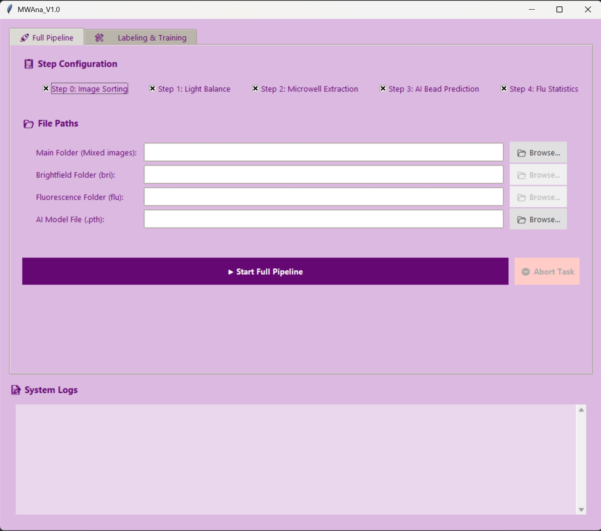
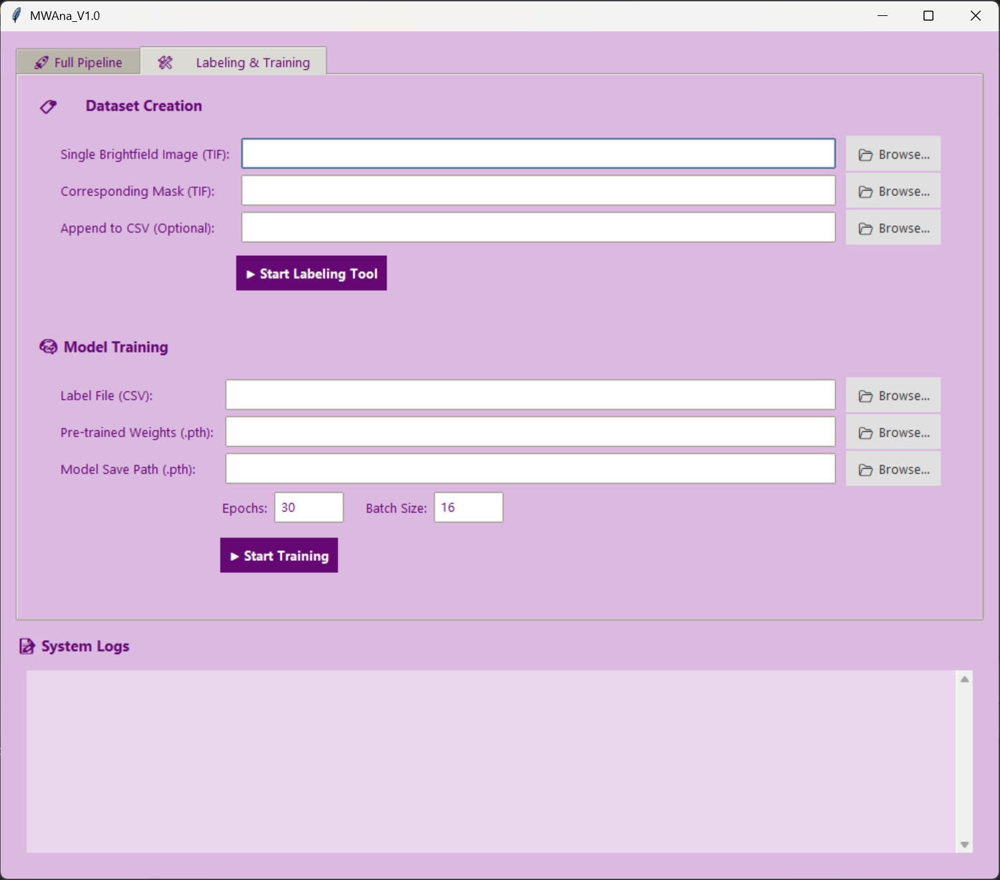
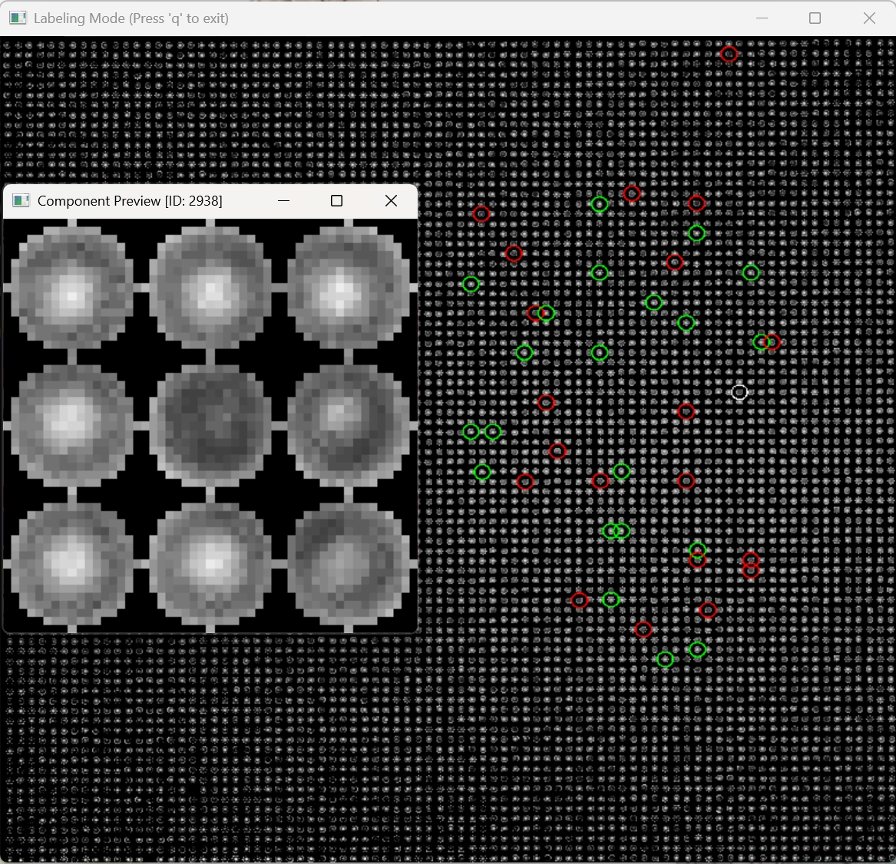
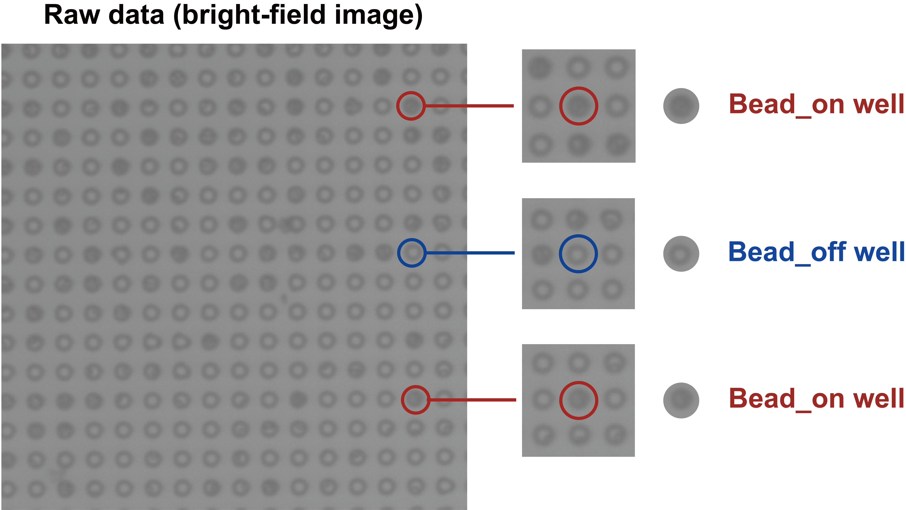

<p align="center">
  
</p>

<h1 align="center">MWAna</h1>

<p align="center">
  <strong>Automated Image Analysis Tool for Microwell-Based dELISA</strong>
  <br>
  用于微坑法数字酶联免疫吸附测定（digital ELISA, dELISA）成像数据的自动化分析工具
</p>

<p align="center">
  
  
  
  
  
</p>

<p align="center">
  
  
  
  <a href="./LICENSE">
    
  </a>
  <a href="https://github.com/sirouto233/MWAna/releases/latest">
  
  </a>
</p>

<p align="center">
  <strong>English</strong>
  &nbsp; | &nbsp;
  <a href="./README_zh-CN.md"><strong>简体中文</strong></a>
</p>

<p align="center">
  <a href="https://github.com/sirouto233/MWAna/releases/latest">⬇️ Release</a>
  &nbsp; · &nbsp;
  <a href="./README.md#-background">🔬 Background</a>
  &nbsp; · &nbsp;
  <a href="./README.md#-quick-start">🚀 Quick Start</a>
  &nbsp; · &nbsp;
  <a href="./README.md#-installation-and-launch">⚙️ Installation and Launch</a>
  &nbsp; · &nbsp;
  <a href="./README.md#-workflow">📦 Workflow</a>
  &nbsp; · &nbsp;
  <a href="./README.md#-user-guide">📱 User Guide</a>
  &nbsp; · &nbsp;
  <a href="./README.md#-project-features">🎆 Project Features</a>
  &nbsp; · &nbsp;
  <a href="./README.md#-license-and-model-source">⚖️ License and Model Source</a>
</p>

<hr style="height:3px;background-color:#66717C;border:none;">

<a id="background"></a>

## 🔬 Background

### ☝️ Overview

An automated data analysis tool for microwell imaging in dELISA assays. It provides **end-to-end image analysis and data extraction** (bright-field/fluorescence image sorting, illumination correction, microwell extraction, identification of wells occupied by beads, and fluorescence signal quantification), together with **model training tools** (a graphical labeling interface and classifier training).

A **well occupied by a bead** is referred to below as a **bead-on well**, and an empty well as a **bead-off well**.

This tool was developed around the image data and file structure produced by the **_Inspire DX single-molecule immunoassay analyzer (iomics, Beijing, China)_**. In principle, it can be adapted to the data analysis requirements of any microwell-based dELISA platform.

For more background, see [Project Background](./documents/BG.md).

<br/>

<a id="quick-start"></a>

## 🚀 Quick Start

*Use the packaged .exe application for quick deployment. The application can directly analyze image data from the **iomics Inspire DX single-molecule immunoassay analyzer**.*

*Tested environment: Windows 11, Python 3.12 (x64), NVIDIA RTX3070, and CUDA 11.8. Computers without a dedicated GPU can also use CPU mode (not recommended).*

_**1. Download the release package**_

Go to the [latest release](https://github.com/sirouto233/MWAna/releases/latest) and download the latest `MWAna.zip` under **Assets**. Extract the archive and open the root folder containing the `_internal` folder, the launcher `launcher.exe`, the prediction model `MWAna_3×3_SwinT-V6.pth`, and the pretrained weights `swin_tiny_patch4_window7_224.pth`.

<br/>

_**2. Launch the graphical interface**_

Run `launcher.exe` and select a language to open the graphical interface.

<br/>

_**3. Select the workflow, source data folder, and classification model**_

Follow the prompts in the graphical interface. For the data formats and folder structures required by each workflow, see the [User Guide](./README.md#-user-guide) below.

**Example — full pipeline:** Select all processing steps at the top, choose the parent folder containing both bright-field and fluorescence images (which can be named `origin`), select the model `MWAna_3×3_SwinT-V6.pth`, and click Run to perform the complete analysis and generate the results.

After analysis, the following folders are created alongside `origin`: `bri` for original bright-field images, `flu` for original fluorescence images, `bri_sol` for processed bright-field images, `bri_mask` for extracted microwell masks, `bri_bead` for predicted bead-on well masks, and `Analysis_Results` for analysis outputs.

The results folder mainly contains subfolders with threshold analysis plots for each image and the results workbook `fluorescence_stats.xlsx`. The workbook includes the **total bead-on well count**, **positive microwell count**, and **raw AMB** for each image, together with **AMB_filtered** after automatic outlier removal and information on the excluded images.

**In most cases, [AMB_filtered] can be used as the analysis result for the group.**



<br/>

_**4. Model training**_

*If bead-on well prediction is not sufficiently accurate, use bright-field images acquired with your own instrument for labeling and training.*

(1) Switch to `Labeling & Training` in the graphical interface. Select one **illumination-corrected bright-field microwell image acquired locally** (from `bri_sol`) and its **corresponding microwell mask** (from `bri_mask`). Click `Start Labeling Tool` to begin labeling in the interactive interface.

**Labeling controls:** Click a microwell to display its 3×3 microwell array classification unit. Use the keyboard keys `1` and `0` to label it: `1` indicates a bead-on well, and `0` indicates a bead-off well. When labeling is complete, press `q` to save and exit. Unless appending to an existing CSV, the program creates a `dataset` folder alongside the bright-field image to store the training images and the label file `label.csv`.

(2) After labeling, select `label.csv` in the generated dataset folder as the **Label File**, select `swin_tiny_patch4_window7_224.pth` as the **Pre-trained Weights**, and specify the model save path, number of epochs, and batch size. Click `Start Training` to train the model.

<p align="center">
  
  
</p>

_**5. Dataset for trial**_

- The project includes a `test/` example image dataset, including a sample folder structure and bright-field and fluorescence images acquired with **Inspire DX**. Use this dataset to become familiar with the directory organization and try the automated batch processing and labeling tools. Download it from [Releases](https://github.com/sirouto233/MWAna/releases).

- The project also provides a `train_set/` example training dataset, including a sample training folder structure, image patches generated by the labeling tool, and a `label.csv` file. Use this dataset to become familiar with the training data organization and try model training. Download it from [Releases](https://github.com/sirouto233/MWAna/releases).


<br/>

<a id="installation-and-launch"></a>

## ⚙ Installation and Launch

*Use the source code package to adjust module parameters, support additional image datasets, improve the project, or integrate it into other systems.*

Tested environment: Windows 11, Python 3.12 (x64), NVIDIA RTX3070, and CUDA 11.8.

_**1. Get the project with Git**_

```powershell
git clone https://github.com/sirouto233/MWAna.git
cd MWAna
```

_**2. Run the project in a virtual environment. Create one in the project folder:**_

```powershell
py -3.12 -m venv .venv
.\.venv\Scripts\Activate.ps1
python -m pip install --upgrade pip
```

_**3. Inference uses an NVIDIA GPU by default. Install the CUDA 11.8 build of PyTorch:**_

```powershell
python -m pip install torch==2.7.1 torchvision==0.22.1 --index-url https://download.pytorch.org/whl/cu118
```

For CPU use, replace the command above with:

```powershell
python -m pip install torch==2.7.1 torchvision==0.22.1 --index-url https://download.pytorch.org/whl/cpu
```

_**4. Install dependencies:**_

```powershell
python -m pip install -r requirements-runtime.txt
python -m pip check
```

- `requirements.txt`: the full dependency list, including the CUDA 11.8 build.
- `requirements-runtime.txt`: runtime dependencies for the staged installation above.
- `requirements-build.txt`: optional PyInstaller dependencies for packaging.

_**5. Launch the project:**_

```powershell
python launcher.py
```

Select a language at startup. You can also run `main_gui_zh.py` or `main_gui_en.py` directly to open the GUI.

<br/>

<a id="workflow"></a>

## 📦 Workflow

### 🚨 Features

**MWAna** was developed around the image data and file structure produced by the **_Inspire DX single-molecule immunoassay analyzer (iomics)_**. Designed for microwell-based dELISA image analysis, the project integrates **image sorting**, **bright-field illumination correction**, **microwell detection**, binary bead classification, and fluorescence signal quantification into an automated batch workflow. It provides Chinese and English graphical interfaces, together with training-set labeling and model training tools, supporting the complete process from sample annotation and model training to batch data analysis.

### 📜 Analysis Steps and Implementation

| Analysis step | Function                                                                                                                                                                   | Module | Key design |
| --- |----------------------------------------------------------------------------------------------------------------------------------------------------------------------------| --- | --- |
| 1. Image sorting | Distinguish bright-field and fluorescence images by filename,<br/>and save them in their respective subfolders                                                             | `image_classifier` | Classification by filename suffix |
| 2. Illumination correction | Reduce uneven illumination across the image,<br/>and enhance contrast between bead-on and bead-off wells                                                                   | `light_balance` | Gaussian smoothing, gamma correction, and CLAHE enhancement |
| 3. Microwell detection | Locate microwells in bright-field images,<br/>and generate a mask of all microwell regions                                                                                 | `microwell_detection` | Hough circle detection |
| 4. Bead-on well classification | Apply the microwell mask to the bright-field image,<br/>extract individual microwell patches,<br/>identify bead-on wells,<br/>and generate a mask of all bead-on wells     | `bead_prediction` | 3×3 microwell neighborhood assembly; **Swin-Transformer Tiny** classifier with spatial attention |
| 5. Mean fluorescence measurement | Apply the bead-on well mask to the fluorescence image,<br/>and calculate the mean fluorescence intensity of each bead-on well                                              | `fluorescence_analysis` | Mean grayscale intensity calculation for each unit |
| 6. AMB calculation | Automatically determine a threshold and identify positive signals,<br/>remove outliers, and calculate an aggregate AMB<br/>(positive microwell count / bead-on well count) | `fluorescence_analysis` | KDE-based automatic thresholding and MAD-based outlier screening |

For details, see [Code Structure and Module Descriptions](./documents/Code_Review.md).

<br/>

<a id="user-guide"></a>

## 📱 User Guide

### _📑 Image Filenames and Folder Structure (Important)_

#### 1. Required data format and folder structure for prediction

```text
EXP (parent folder for one experiment)
├── origin (mixed bright-field and fluorescence images)
│   └── 1 (original data subfolder)
│       ├── pic-01-0-1.tif (bright-field image for pic-01-0)
│       ├── pic-01-0-2.tif (fluorescence image for pic-01-0)
│       ├── pic-02-0-1.tif (bright-field image for pic-02-0)
│       ├── pic-02-0-2.tif (fluorescence image for pic-02-0)
│       └── ...
├── bri (bright-field images)
│   └── 1
│       ├── pic-01-0-1.tif (bright-field image for pic-01-0)
│       ├── pic-02-0-1.tif (bright-field image for pic-02-0)
│       └── ...
├── flu (fluorescence images)
│   └── 1
│       ├── pic-01-0-2.tif (fluorescence image for pic-01-0)
│       ├── pic-02-0-2.tif (fluorescence image for pic-02-0)
│       └── ...
├── bri_sol (preprocessed bright-field images)
│   └── 1
│       ├── pic-01-0-1_sol.tif (preprocessed bright-field image for pic-01-0)
│       ├── pic-02-0-1_sol.tif (preprocessed bright-field image for pic-02-0)
│       └── ...
├── bri_mask (microwell masks)
│   └── 1
│       ├── pic-01-0-1_mask.tif (binary microwell mask for pic-01-0)
│       ├── pic-02-0-1_mask.tif (binary microwell mask for pic-02-0)
│       └── ...
├── bri_bead (predicted bead-on well masks)
│   └── 1
│       ├── pic-01-0-1_bead.tif (binary bead-on well mask for pic-01-0)
│       ├── pic-02-0-1_bead.tif (binary bead-on well mask for pic-02-0)
│       └── ...
└── Analysis_Results (analysis results)
    ├── 1
    │   ├── scatter_pic-01-0-2.tif (mean fluorescence scatter plot and threshold for pic-01-0)
    │   ├── scatter_pic-02-0-2.tif (mean fluorescence scatter plot and threshold for pic-02-0)
    │   └── ...
    └── fluorescence_stats.xlsx (main analysis results workbook)
```

- Keep a subfolder level beneath the main folders such as `origin` and `bri`. The **name of the subfolder containing the images** (such as `1`) is used as the group label in the analysis results.
- The automated workflow generates the downstream image files and folder structure from the selected starting point.

#### 2. Required data format and folder structure for training

```text
dataset (training dataset folder)
├── label.csv (automatically generated label table)
├── (example training images below; filename suffixes are generated by the labeling tool)
├── pic-01-0-1_sol_comp112_bead_3x3 (3×3 microwell array for component 112 from pic-01-0-1_sol)
├── pic-02-0-1_sol_comp5154_empty_3x3 (3×3 microwell array for component 5154 from pic-02-0-1_sol)
└── ...
```

- These files are normally generated automatically by the labeling tool.

### _🏃 Using the GUI_

#### _Batch analysis_

1. Select the input folders and the steps to run:
   - Enable image sorting to run the full pipeline, and select `origin` directly.
   - If the images are already sorted, select `bri` and `flu`.
   - To use images that have already undergone illumination correction, select `bri_sol` and `flu`.
   - If the microwell mask folder `bri_mask` already exists, skip mask detection while keeping `bri_sol` and `flu` selected.
   - If the bead-on well mask folder `bri_bead` already exists, select `bri_bead` and `flu`.
2. Select the AI prediction model file.
3. Wait for automatic processing and monitor progress, the bead-on well count per image, and processing time in the log panel.
4. Open the output folders to view masks, scatter plots, and AMB analysis reports.


<br/>

When skipping a step, retain the results generated by the preceding steps. Place `bri_sol`, `bri_mask`, and `bri_bead` alongside `bri`.

Rerunning the workflow overwrites outputs with the same filenames. Keep separate experiments in separate directories.

#### _Labeling and training_

1. On the labeling page, select a bright-field image from `bri_sol` and its corresponding mask from `bri_mask`. Click `Start Labeling Tool` to open the interactive GUI.
2. Left-click a microwell to view its 3×3 neighborhood. Press **0** for a bead-off well, **1** for a bead-on well, or **q** to exit the current preview. Press **q** in the main window to finish and save. Patches and the label CSV are saved by default in a `dataset` folder alongside the image; you can also select an existing CSV to append more annotations.
3. On the training page, select the label CSV, pretrained weights, and output model path, then set the number of epochs and batch size and start training. By default, 80% of the data is used for training and 20% for validation. Training uses AdamW with a learning rate of `1e-4` and cross-entropy loss; the defaults are 30 epochs and a batch size of 16. The log displays loss and validation accuracy. The model is saved according to the existing accuracy- or loss-improvement rules, and training stops early after consecutive epochs without improvement.

<p align="center">
  
  
</p>

Before starting, confirm that the image paths in the CSV are valid, remove duplicate or conflicting labels, and create the model output folder.

#### _Abnormal images and outlier removal_

Residual aqueous-phase spreading can cause an unusually high positive fraction in some images. Within each image group, the program screens for high AMB values based on the median and dispersion, and removes results with abnormally low valid microwell counts to ensure analysis accuracy.

Screening uses the median absolute deviation (MAD) to describe variation in AMB within a group and incorporates the valid microwell count of each image into the score. By default, screening requires at least **5 valid images**. High-value images with scores above **3.5** are excluded from the filtered summary; low-value images are retained. The report provides:

- **Raw AMB:** calculated using all valid images.
- **Filtered AMB:** recalculated after excluding high-value outlier images.
- **Exclusion list:** image paths, raw AMB values, scores, and reasons, allowing the original images to be reviewed.

Screening only determines which images are included in the summary. It does not delete the original images or change the fluorescence threshold for any individual image. **Keep different samples or concentrations in separate folders so they are not compared as a single group.**

Excluded images are listed separately for subsequent review.

### _🔎 Other Notes_

- In principle, this project can also analyze image data from other microwell-based dELISA platforms, provided that bright-field and fluorescence images correspond one-to-one, the same microwells occupy the same pixel positions, and the folders follow the structure above. If image pixel size, resolution, or magnification changes, adjust the Hough circle detection parameters in `microwell_detection` accordingly.

- Parameter settings for different acquisition conditions

  Hough circle detection depends on the size and spacing of microwells in the image. After changing the instrument, objective, or acquisition resolution, adjust the search radius, center spacing, and mask size to match the new microwell appearance. First check the following parameters in `microwell_detection.py`:

| Parameter | Default | Basis for adjustment |
| --- | --- | --- |
| `minRadius` / `maxRadius` | 6 / 10 | Microwell radius in pixels |
| `minDist` | 20 | Distance between adjacent microwell centers in pixels |
| `param1` / `param2` | 30 / 14 | Detection sensitivity, contrast, and noise |
| Mask radius | 8 | Microwell region to retain |

- If fewer fluorescence images are paired than expected, check filename suffixes, relative subfolders, and whether the corresponding `_bead.tif` files are present. If microwells are missed, first inspect the Hough parameters and generated masks.

- The project includes a `test/` example image dataset, including a sample folder structure and bright-field and fluorescence images acquired with **Inspire DX**. Use this dataset to become familiar with the directory organization and try the automated batch processing and labeling tools. Download it from [Releases](https://github.com/sirouto233/MWAna/releases).

- The project also provides a `train_set/` example training dataset, including a sample training folder structure, image patches generated by the labeling tool, and a `label.csv` file. Use this dataset to become familiar with the training data organization and try model training. Download it from [Releases](https://github.com/sirouto233/MWAna/releases).

- <br/>

<a id="project-features"></a>

## 🎆 Project Features

### A 3×3 Microwell Matrix as the Classification Unit

Illumination may vary across different regions of an image, so the brightness of a single microwell alone cannot determine whether it contains a bead. This project therefore uses a **3×3 microwell matrix** as the classification unit: the target microwell is placed at the center, and images of microwells at the eight surrounding positions provide the neighborhood context used to determine bead occupancy in the central microwell.



This approach provides local references for brightness and morphology. When identifying local intensity and texture changes caused by beads, the model can also compare the appearance of neighboring microwells, reducing interference from regional illumination differences. The preceding illumination correction step improves the illumination distribution across the entire image, while neighborhood comparison provides additional local references.

Both training-set labeling and batch prediction use this neighborhood representation. Each microwell array has a single label indicating whether the central microwell is a bead-off or bead-on well. The surrounding microwells provide comparison information without requiring their classes to be known in advance. The program selects and assembles neighborhood images by position and uses nearby regions or reflection to fill missing positions at image boundaries or where neighboring microwells are unavailable.

### Swin-Transformer Tiny

This project uses the **Swin-Transformer V1** deep learning architecture to train a binary classifier, with pretrained weights for `swin_tiny_patch4_window7_224`. The main reason for selecting this model is its spatial self-attention mechanism: it can learn relationships between image locations and combine details of the central microwell with information from the surrounding reference microwells.

Swin-Tiny first extracts features within local windows, then connects adjacent regions through shifted windows and progressively builds image representations with a broader spatial scope. For a 3×3 microwell matrix, this structure helps combine the central microwell's local appearance with neighborhood comparisons, ultimately producing the probabilities that the central microwell is a bead-off or bead-on well.

Each input microwell array is resized to **224×224**, weighted using a fixed radial intensity profile that assigns greater weight to the central region (a vignette filter), replicated into three channels, and normalized using the ImageNet mean and standard deviation. This intensity weighting is an image preprocessing step; spatial attention is learned by the model during training. During prediction, microwells with a bead-on class probability greater than **0.5** are retained as valid units.

<br/>

<a id="license-and-model-source"></a>

## ⚖ License and Model Source

This project is released under the **MIT License**. See [LICENSE](./LICENSE).

The model architecture and pretrained weights used in this project are obtained through [timm](https://github.com/huggingface/pytorch-image-models).

Model paper: Liu et al., [Swin Transformer: Hierarchical Vision Transformer using Shifted Windows](https://doi.org/10.1109/ICCV48922.2021.00986), 2021 IEEE/CVF International Conference on Computer Vision (ICCV), Montreal, QC, Canada, 2021, pp. 9992–10002, doi: 10.1109/ICCV48922.2021.00986.
